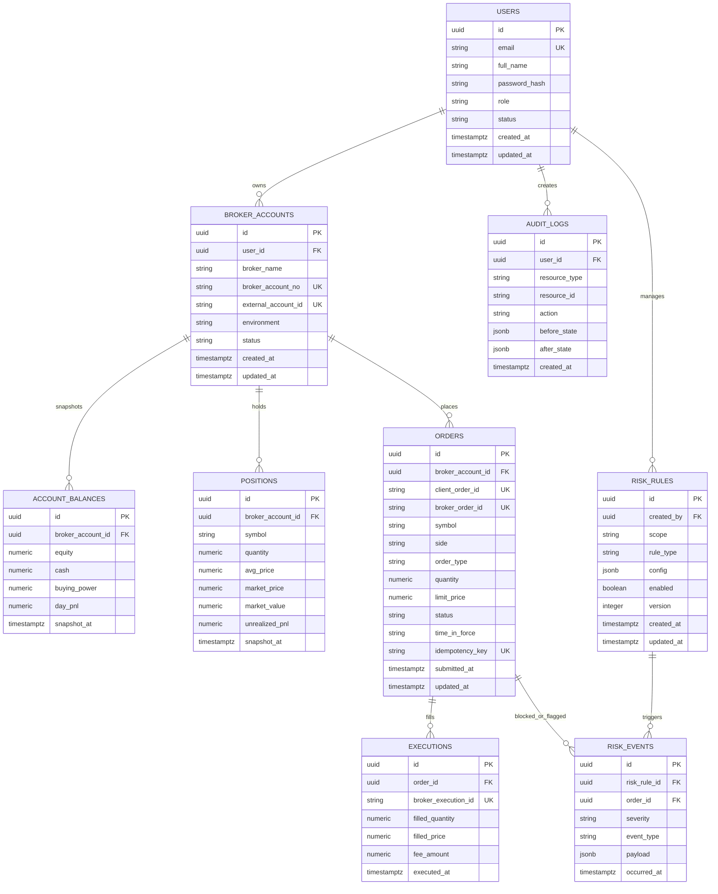

# 一期 ER 图

## 约束与索引

- `users.email` 唯一。
- `broker_accounts.external_account_id` 唯一。
- `orders.client_order_id` 与 `orders.idempotency_key` 唯一。
- `positions` 建议唯一键：`(broker_account_id, symbol, snapshot_at)`。
- 高频查询索引：
  - `orders(broker_account_id, status, submitted_at desc)`
  - `executions(order_id, executed_at desc)`
  - `risk_events(occurred_at desc, severity)`
  - `audit_logs(resource_type, resource_id, created_at desc)`
