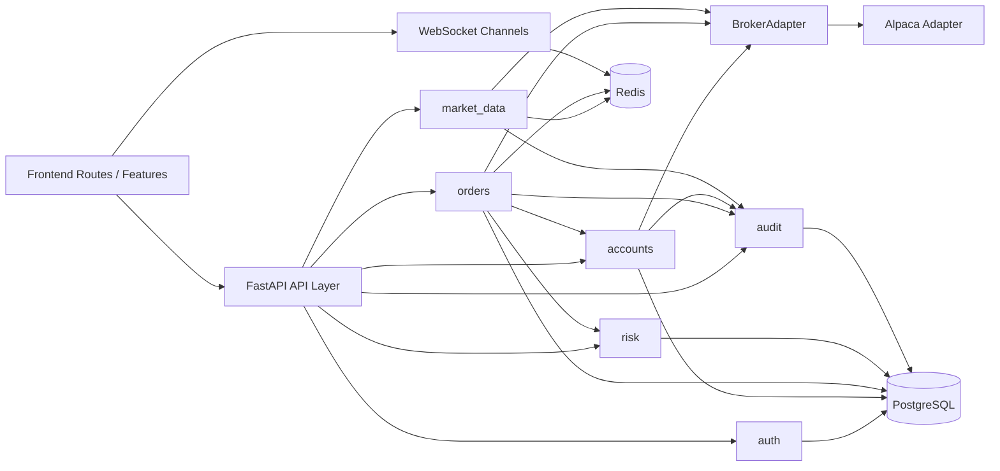

# 模块边界图

## 核心领域

- `auth`：认证、令牌、会话、角色上下文。
- `users`：用户资料、偏好、通知偏好。
- `accounts`：Broker 账户、账户余额、持仓快照。
- `market_data`：行情订阅、行情缓存、广播。
- `orders`：下单、撤单、订单状态机、成交回报映射。
- `strategies`：一期仅保留边界，Phase 1 不直接实现。
- `risk`：风控规则、预检查、命中事件。
- `audit`：关键操作与状态变更审计。

## 数据归属

- Broker 提供：账户基础信息、余额、持仓、订单外部状态、实时报价。
- 本系统持久化：用户、角色、Broker 绑定关系、订单幂等键、风险规则、风险事件、审计日志。
- 双向映射：订单与成交需要同时记录内部 ID 和外部 Broker ID。

## 依赖原则

- `orders` 允许依赖 `accounts`、`market_data`、`risk`、`audit`。
- `risk` 不依赖 UI 或 Broker SDK，只依赖标准化订单与账户 DTO。
- `integrations.brokers.alpaca` 只能被应用服务层调用，不得被前端契约直接引用。

## BrokerAdapter 边界

Broker 适配层必须提供以下能力：

- 查询账户总览
- 查询持仓
- 提交订单
- 撤销订单
- 查询订单状态
- 订阅或轮询订单回报
- 订阅或轮询行情

适配层返回值统一映射为内部 DTO：

- `BrokerAccountSnapshot`
- `BrokerPositionSnapshot`
- `BrokerOrderRequest`
- `BrokerOrderSnapshot`
- `BrokerQuote`
